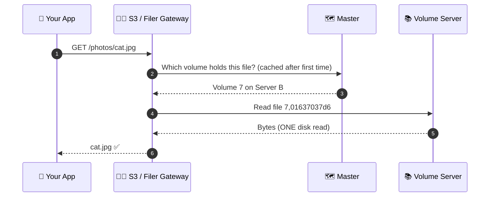

<div align="center">


<br/>


### 🗄️ Store billions of files. Find any one of them in a single disk read.

**[What is it?](#-what-is-sovereignfs-in-plain-english)** ·
**[Why it matters](#-why-it-matters)** ·
**[Architecture](#-architecture)** ·
**[Quick start](#-quick-start-run-it-in-60-seconds)** ·
**[Kubernetes](#-deploy-on-kubernetes)** ·
**[Tech stack](#-tech-stack)**

</div>


## 📌 TL;DR (for recruiters & busy people)

| | |
|---|---|
| **What** | A cloud-native, distributed storage platform written in **Go**, offering both **S3-compatible object storage** and **POSIX-style file access** on the same data. |
| **Problem solved** | Traditional storage slows down or becomes expensive as file counts reach millions or billions. SovereignFS keeps reads at **O(1)**: one disk lookup per file, regardless of total size. |
| **How it scales** | Need more capacity? Start another *volume server*. No re-architecting, no downtime. |
| **How it survives failures** | Data is **replicated** across servers, racks and data centers, and cold data can be **tiered to public clouds**. |
| **How it ships** | Packaged for **Docker**, **Docker Compose**, **Kubernetes (Helm)** and **Terraform (AWS)**, with Prometheus metrics, an Admin UI, and 70+ automated CI pipelines. |
| **Skills demonstrated** | Distributed systems · Go · Cloud infrastructure · Kubernetes · DevOps/CI-CD · API design (S3) · Fault tolerance · Observability |


## 🌍 What is SovereignFS? (in plain English)

Every app you use — photo galleries, video platforms, online banking, hospital records — has to **keep files somewhere**. When a company has a few thousand files, a normal server is fine. When it has **billions**, things break: searches get slow, hardware fails, and bills explode.

**SovereignFS is the "warehouse system" that solves this.** It spreads files across many ordinary computers, keeps track of where everything is, keeps backup copies automatically, and lets you add more space just by plugging in another machine.


**Why "Sovereign"?** Because **you own the system**. It runs on your own servers, your own Kubernetes cluster, or any cloud — no vendor lock-in, and your data never has to leave infrastructure you control.


## 💡 Why it matters

| 😖 The usual problem | ✅ What SovereignFS does |
|---|---|
| Finding a file gets slower as storage grows | **O(1) access**: one disk read per file, always. The index is tiny (16 bytes per file in memory). |
| Adding capacity means painful migrations | **Horizontal scaling**: start another volume server and capacity grows. No data reshuffle. |
| A dead server means lost data or downtime | **Replication** keeps copies on separate servers/racks/data centers; reads fail over instantly. |
| Cloud storage bills grow forever | **Cloud tiering** moves cold data to S3 / GCS / Azure while keeping it readable. |
| Apps speak different "storage languages" | **One system, many doors**: S3 API, mountable folders (FUSE), WebDAV, SFTP, HTTP. |
| Hard to run and monitor | **Docker, Helm, Terraform**, Prometheus metrics, an Admin UI, and automated maintenance workers. |


## ✨ Key features

<table>
<tr>
<td width="50%" valign="top">

### ⚡ Blazing-fast access
- **O(1) reads and writes**: a single disk seek per file
- Small files packed into append-only volumes (no per-file overhead)
- Master is **not in the read path**; clients talk to data servers directly
- Optional **Rust volume server** for lower tail latency on the same on-disk format

### 📦 Dual interface: Object + File
- **S3-compatible API**: works with AWS SDKs, AWS CLI, rclone, restic, Spark, Trino
- Versioning, Object Lock, lifecycle rules, multipart uploads, presigned URLs
- **POSIX-style files** via FUSE mount (Linux, macOS, Windows), WebDAV, SFTP
- IAM users/policies, STS, and bucket policies

</td>
<td width="50%" valign="top">

### 🛡️ Fault tolerant by design
- Configurable **replication** (rack and data-center aware)
- **Erasure coding** for warm data, saving space without losing safety
- **Raft consensus** across master servers for failover
- Automatic repair, balancing and vacuum via maintenance workers

### ☁️ Cloud-native & hybrid
- **Cloud tiering**: offload cold volumes to S3, Google Cloud Storage or Azure
- **Cloud Drive**: mount a cloud bucket and serve it at local speed
- **Active-active replication** between clusters / regions
- Encryption at rest (AES-256-GCM), TLS/mTLS, JWT-signed access

</td>
</tr>
</table>

### ☁️ Smart storage lifecycle


## 🏗️ Architecture


SovereignFS has three building blocks. Each does one job, which is why it scales so well:

| Component | Role (simple) | Role (technical) |
|---|---|---|
| 🗺️ **Master servers** | The "map" that knows which shelf holds what | Track **volumes** (not individual files), assign file IDs, run Raft for HA. Because they track only a few thousand volumes even for billions of files, they stay tiny. |
| 📚 **Volume servers** | The shelves where data actually lives | Store blobs in append-only volume files, keep an in-memory index, handle replication and erasure coding. **Scale out by adding more.** |
| 🧑‍💼 **Filer & S3 gateway** | The front desk that speaks every language | Stateless services adding directories, permissions, S3, WebDAV, SFTP and FUSE on top. Metadata lives in a store of your choice (PostgreSQL, MySQL, Redis, Cassandra, etcd, TiKV, FoundationDB, LevelDB, and more). |

### 🔁 How a file read works (the "O(1)" secret)



### 🛟 Surviving failures


## 🚀 Quick start: run it in 60 seconds

> **Prerequisites:** a built `weed` binary or Docker. The command-line binary keeps its engine name `weed`.

### Option 1: One command (S3 storage on your laptop)

```bash
AWS_ACCESS_KEY_ID=admin \
AWS_SECRET_ACCESS_KEY=secret \
S3_BUCKET=my-bucket \
./weed mini -dir=./data
```

Your S3 endpoint is now live at **http://localhost:8333**.

```bash
# Upload a file using the standard AWS CLI
AWS_ACCESS_KEY_ID=admin AWS_SECRET_ACCESS_KEY=secret \
  aws --endpoint-url http://localhost:8333 s3 cp README.md s3://my-bucket/
```

### Option 2: Docker

```bash
docker run -p 8333:8333 -v sovereignfs-data:/data \
  -e AWS_ACCESS_KEY_ID=admin \
  -e AWS_SECRET_ACCESS_KEY=secret \
  -e S3_BUCKET=my-bucket \
  chrislusf/seaweedfs
```

### Option 3: Docker Compose (full cluster: master, volume, filer)

```bash
docker compose -f docker/seaweedfs-compose.yml -p sovereignfs up
```

### Option 4: Build from source

```bash
git clone https://github.com/<your-username>/SovereignFS-Distributed-Cloud-File-Object-Storage-Platform.git
cd SovereignFS-Distributed-Cloud-File-Object-Storage-Platform/weed
make install        # requires Go (see go.mod for the version)
```

### 📈 Scale out: add capacity in one line

```bash
weed volume -dir=/data -master=<master_host>:9333
```

| Service | Default port |
|---|---|
| Master | `9333` |
| Volume server | `8080` |
| Filer | `8888` |
| S3 API | `8333` |


## ☸️ Deploy on Kubernetes

A Helm chart lives in [`k8s/charts/seaweedfs`](k8s/charts/seaweedfs) with templates for master, volume (StatefulSet), filer, S3, SFTP, admin and worker components, plus Prometheus ServiceMonitors and Grafana dashboards.

```bash
helm install sovereignfs ./k8s/charts/seaweedfs \
  -n sovereignfs --create-namespace -f values.yaml
```

Example production-shaped `values.yaml` (3 masters, replicated writes, S3 with auth):

```yaml
global:
  seaweedfs:
    enableReplication: true
    replicationPlacement: "001"   # one extra copy on another server

master:
  replicas: 3

volume:
  replicas: 3
  dataDirs:
    - name: data
      type: persistentVolumeClaim
      size: 500Gi

filer:
  replicas: 2

s3:
  enabled: true
  replicas: 2
  enableAuth: true
  createBuckets:
    - name: app-storage
```

### 🌩️ Infrastructure as Code

[`terraform/`](terraform) contains reusable modules (`core`, `aws`, `security`) and two AWS examples: **all-in-one** and **highly-available distributed**.


## 🧰 Tech stack

| Layer | Technologies |
|---|---|
| **Language** | Go (core), Rust (optional high-performance volume server) |
| **APIs & protocols** | S3 (objects, IAM, STS, S3 Tables), HTTP REST, gRPC, FUSE, WebDAV, SFTP |
| **Distributed systems** | Raft consensus, replication, erasure coding, consistent volume placement |
| **Metadata stores** | PostgreSQL, MySQL, SQLite, Redis, Cassandra, etcd, TiKV, FoundationDB, MongoDB, LevelDB/RocksDB, Elasticsearch, and more |
| **Cloud & DevOps** | Docker, Docker Compose, Kubernetes, Helm, Terraform, GitHub Actions |
| **Observability** | Prometheus metrics, Grafana dashboards, Admin UI |
| **Security** | TLS/mTLS, JWT, AES-256-GCM at rest, SSE-S3/KMS/C, IAM & bucket policies, OIDC/LDAP |
| **Cloud backends** | AWS S3, Google Cloud Storage, Azure Blob and any S3-compatible store |


## 🧪 Testing & reliability

The repository carries a very large automated safety net:

- **1,400+ Go test files** (unit and integration) alongside 3,100+ Go source files
- **70+ GitHub Actions workflows** covering S3 compatibility, erasure coding, multi-master failover, FUSE, Kafka, KMS, TLS rotation, performance and more
- Dedicated integration suites in [`test/`](test): S3, S3 Tables, SFTP, FUSE, multi-master, erasure coding, volume server, TLS rotation, POSIX conformance (pjdfstest) and others

## 📊 Performance snapshot

> Reference figures from the engine's own benchmark on a **single MacBook with SSD** (1 million 1 KB files, concurrency 16). They show the O(1) design in action; results on a real cluster grow with every added volume server.

| Operation | Requests / sec | Median latency | 99th percentile |
|---|---|---|---|
| Write | **15,708** | 0.8 ms | 2.6 ms |
| Random read | **47,019** | 0.3 ms | 0.7 ms |

Mixed S3 workload (warp): **~3.3 GiB/s** total throughput on one node.


## 🗂️ Repository map

```text
SovereignFS/
├── weed/            # Core Go engine: master, volume, filer, S3 API, FUSE mount, replication, EC
├── seaweed-volume/  # Optional Rust volume server (same on-disk format)
├── seaweed-worker/  # Background maintenance worker
├── k8s/charts/      # Helm chart for Kubernetes
├── docker/          # Dockerfiles, Compose stacks, Prometheus config
├── terraform/       # AWS infrastructure modules & examples
├── test/            # Integration & conformance test suites
├── .github/         # 70+ CI/CD workflows
└── cmd/, util/, telemetry/, postgres-examples/ ...
```

## 🎯 Project highlights

- **Engineered a highly scalable distributed storage platform in Go** supporting S3 object storage and POSIX file access, with O(1) data access, horizontal volume-server scaling, replication, cloud tiering, and fault-tolerant storage for billions of files.
- **Designed, tested, and deployed a cloud-native storage architecture** across Docker and Kubernetes, integrating distributed volume servers, metadata/file services, S3 APIs, and automated scaling to improve throughput, availability, and operational reliability.

## 🙏 Acknowledgements & lineage

SovereignFS is built on top of the open-source **[SeaweedFS](https://github.com/seaweedfs/seaweedfs)** engine created by Chris Lu and contributors, whose design draws on Facebook's *Haystack* and *f4* papers. All upstream code remains under the **Apache License 2.0**; the original copyright and license notices are preserved in [`LICENSE`](LICENSE). Credit to the upstream community for the core engine.

## 📄 License

Licensed under the **Apache License 2.0**. See [`LICENSE`](LICENSE).

<div align="center">


**⭐ If this project helped you understand distributed storage, consider giving it a star!**

</div>
